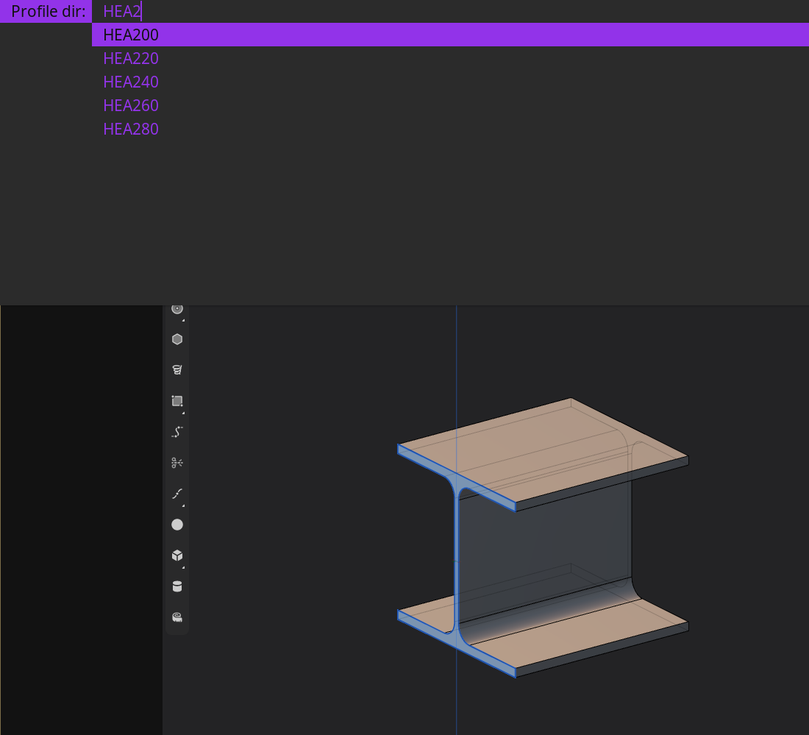

# 0xMat - 0xCADFACE's Material & Profile Library

**0xMat** is a Bash-based profile library for [Plasticity](https://www.plasticity.xyz).  
It streamlines the use and generation of standardized CAD profiles while remaining compliant with all terms of service.



0xMat provides:

- A **profile selector** that uses `find`, `dmenu`, and `xclip` to copy Plasticity binary profile files directly to your clipboard.
- A **profile generator** that automates the creation of standardized section profiles using Plasticity and `xdotool`.
- A simple **installation script** for easy setup.

---

## Features

- Browse and copy profiles quickly using `dmenu`
- Paste Plasticity profiles directly from the clipboard via `xclip`
- Generate standard EN 1993 structural profiles using Plasticity automation
- Uses `xdotool` for compliant automated generation (no redistribution of proprietary files)
- Written entirely in Bash for portability and simplicity

---
## Dependencies

### Runtime dependencies (for using profiles)

- bash  
- find  
- dmenu  
- xclip  

### Generator dependencies (for creating profiles)

- plasticity  
- xvfb  
- xdotool  
- zenity  
- Xephyr (or xephyr)  

### Optional (debug)

- x11vnc  

---

## Installation

Clone the repository, generate profiles and run the installer:

## Prerequisites for Profile Generation

The profile generator tool assumes you are using the default key bindings in the application.  
These must match the following mappings for the tool to work correctly:

| Action | Default Key |
|--------|--------------|
| Search dialog | F |
| Line tool | Shift + A |
| Circle tool | Shift + C |
| Move tool | G |
| Mirror tool | Alt + X |
| Viewport: Focus | / |
| Viewport: Navigate to Front | Numpad 1 |

Note: Custom key bindings are not yet supported.  
A configuration file to define or override shortcuts will be added in a future update.

```bash
git clone https://github.com/0xCADFACE/0xMat.git
cd 0xMat
./generate_profiles_xvfb.sh
./install.sh
